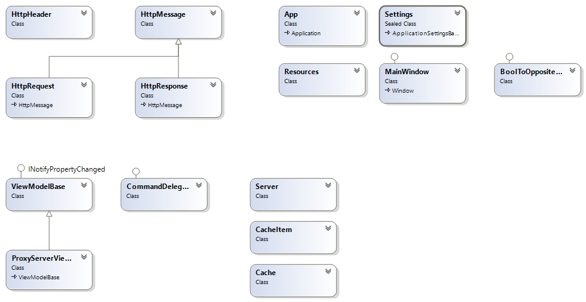
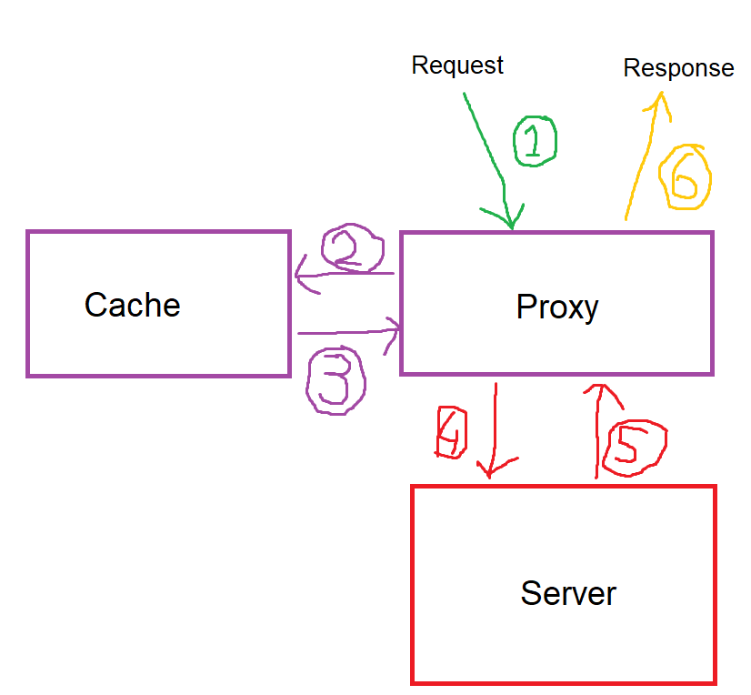

# Algemene beschrijving applicatie
Deze applicatie wordt gemaakt voor het vak NotS-WIN. Dit is een Proxyserver gemaakt vanuit het TCP-protocol, hierop zal een eigen HTTP-protocol gebouwd worden om zo request op te vangen en door te sturen. Alle netwerkverkeer zal gemonitord worden op de server. Verder zal er caching plaats vinden op de server om zo de snelheid hoger te maken. 

## Class diagram
Om een beetje inzicht te kunnen krijgen wat de applicatie inhoud is het volgende class diagram opgesteld. Hierin zijn alle classes te zien die gemaakt zijn om tot het eindproduct te komen. Hierin is tevens ook te zien hoe het HTTP protocol is toegepast en hoe het MVVM pattern toegepast is.

## Flowchart
Wat doet de applicatie nou precies? Om dit een beetje te kunnen laten zien is er een flowchart opgesteld. Hierin is te zien dat een request (1) binnenkomt op de proxy server en vervolgens gaat checken of dit request als in zijn cache staat (2 en 3). Als dit te vinden is in de cache, dan wordt er een response gemaakt en terug gestuurd naar de client (6). Mocht dit immers niet zo zijn, dan zal de request doorgestuurd worden naar de server die hierop, als goed is, een response op zal geven (4 en 5), daarna zal alsnog het response terug gestuurd worden (6) en mits mogelijk de data te verwerken in de cache (4).

